# 因子挖掘及回测
1
## 设计了4种前瞻收益标签，包含第二天return，四天内return均值减标准差，四天内return均值，持有四天return。因子（仅量价）挖掘效果如下：

效果分别为

  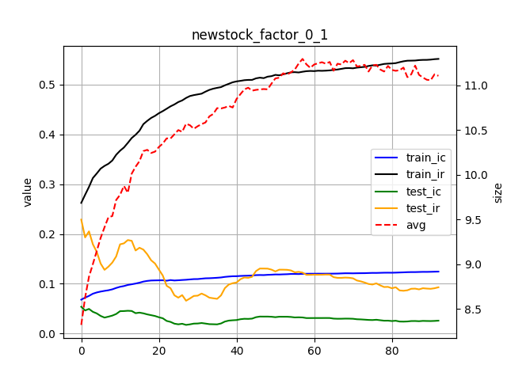
  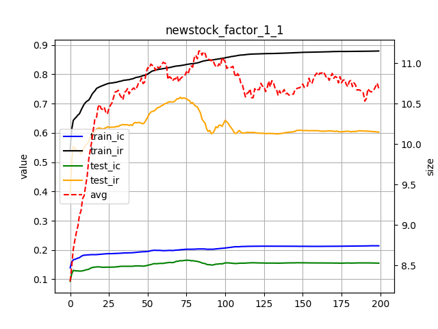

  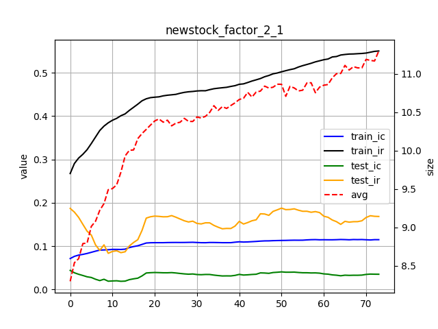
  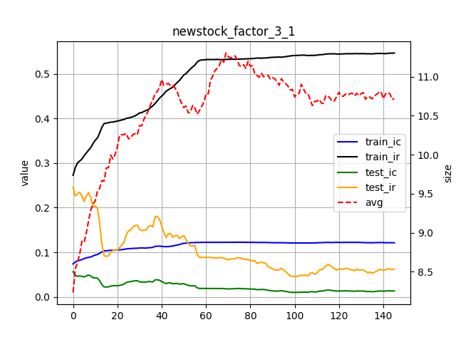

### VNPY框架下的回测结果：多元线性回归和Transformer模型的对比

  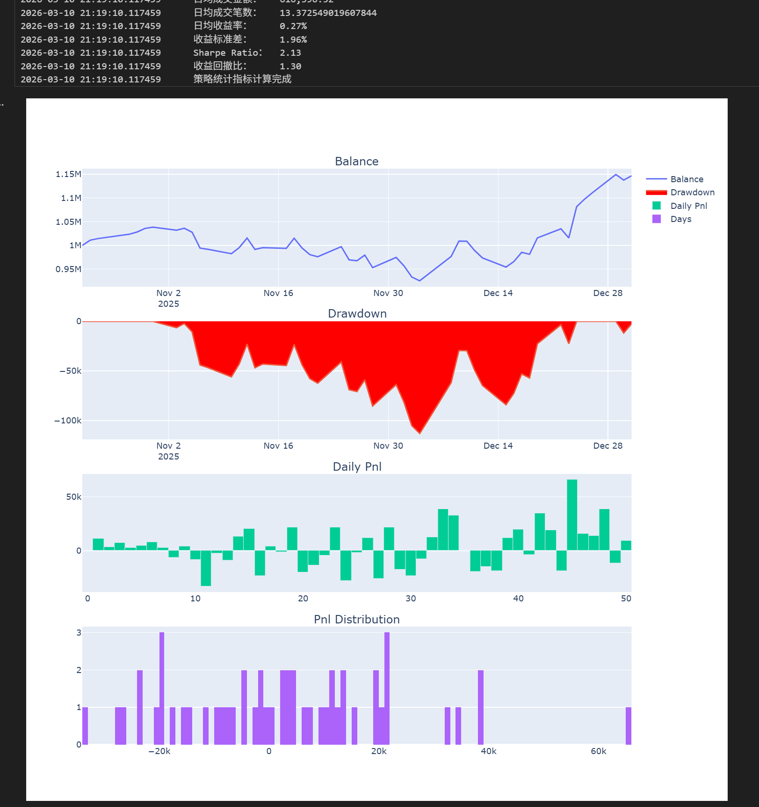
  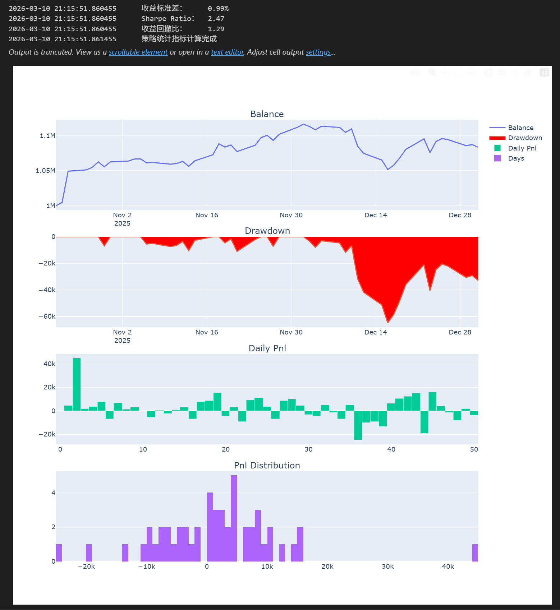

其中，多元线性回归达到2.13夏普率，Transformer模型达到2.47夏普率

### 考虑到label_1最好，对其使用因子（量价+基本面信息）的情况下，因子挖掘效果如下：
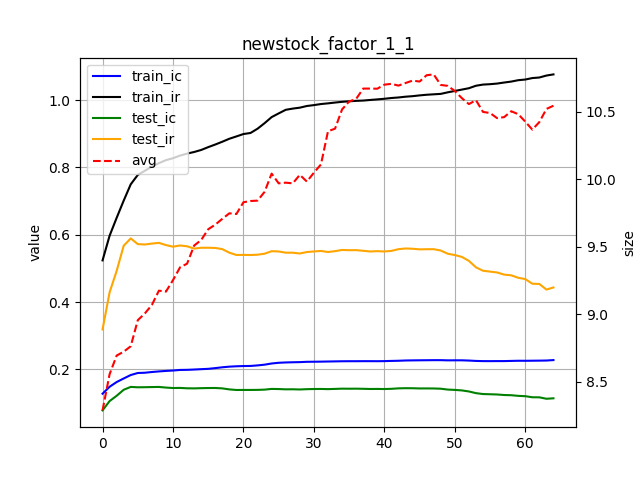

其中，回测时，仅多元线性回归达到2.59夏普率，
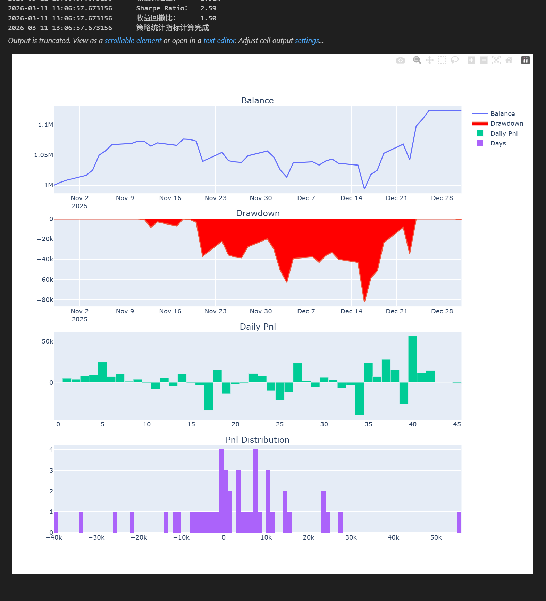

## 在长期时间段下因子（量价+基本面信息）的效果如下：

16年初-23年末训练，24年末测试:

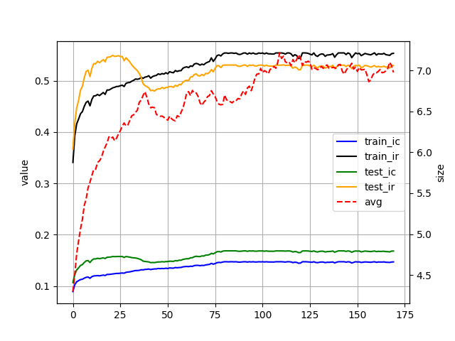

10年初-20年末训练，21年初-25年末测试:

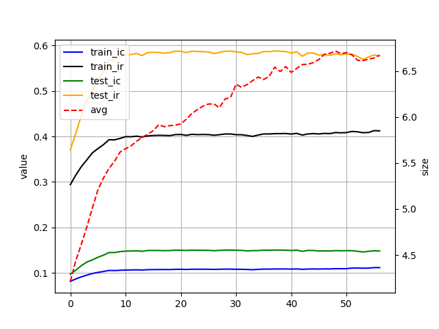

(本项目为自动因子挖掘，考虑到市场变化，本项目更期望使用短期时间训练测试，并持续迭代)

# 目前项目进展（已完成）：
- LLM模型辅助的因子挖掘：使用Deepseek API；

- 多种平滑处理的前瞻收益：买入后分四天卖出；持续持有四天；

- 多种适应度评估：因子IC，IC符号统一率，IC自相关度相关的评估方法；

- 防过拟合选择策略：分层策略选择。

## 部分结果如下

## 分层策略选择（防过拟合）：

未使用分层策略+(μ, λ)：在gp中，大多算法使用(μ, λ)来防止(μ + λ)带来的过拟合，其效果如下

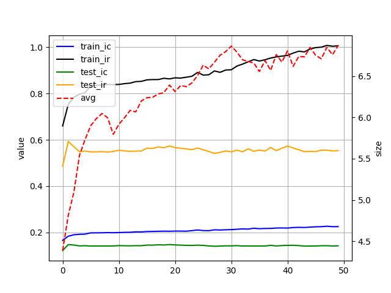

使用分层策略+(μ, λ)选择：

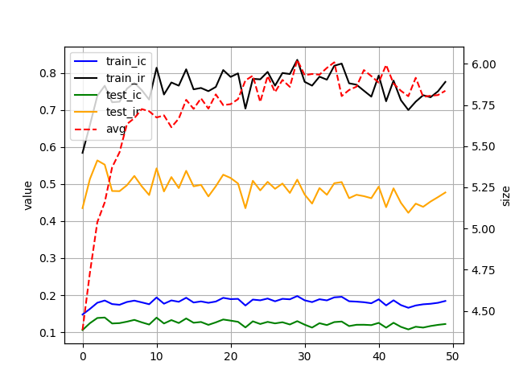

使用分层策略+(μ + λ)选择：考虑到分层策略选择已经有效降低了过拟合，可以将(μ, λ)换成训练集效果更好但是过拟合差的(μ + λ)策略：

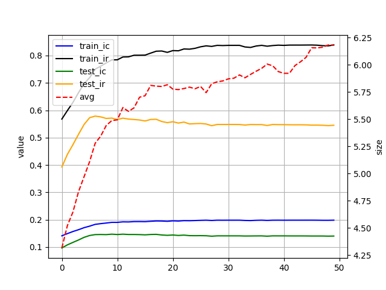

### 虽然test IR未提升，但是 train IR 与 test IR的差异减小，这有效降低了训练集过拟合问题

## 多种适应度评估，使用IR（左图）和 IC符号统一率（右图）训练如下，效果明显优化和过拟合问题减弱（持续测试中）：
（使用了持有四天的前瞻收益，IR相对不高，但利于看到较明显的区别）

  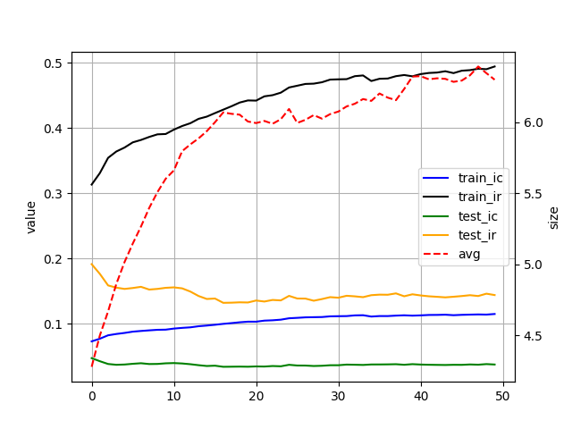
  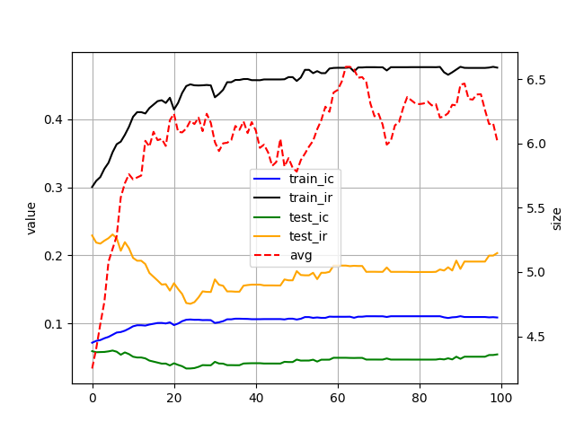

    
